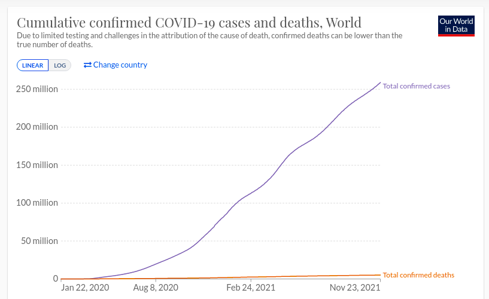
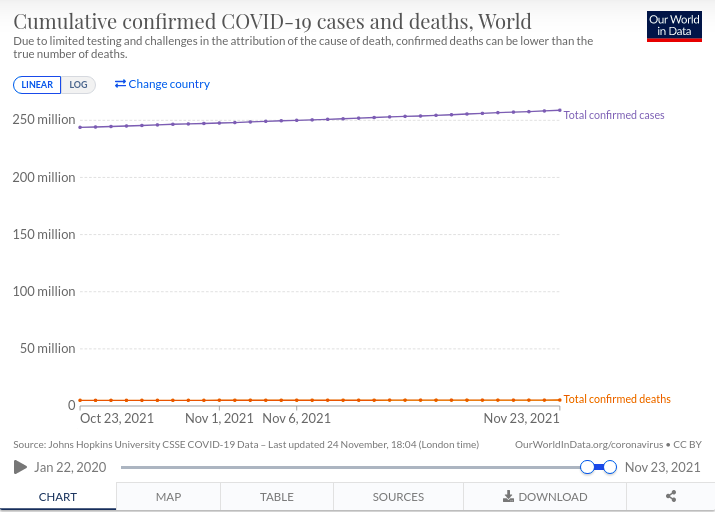
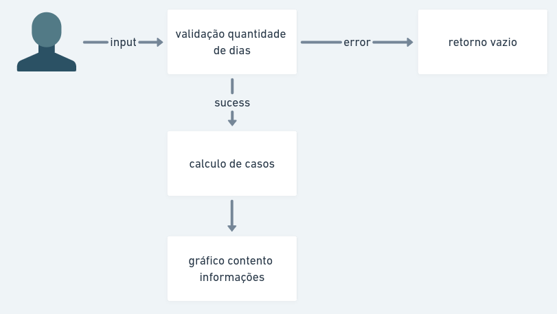

## Instalando as dependencias

```bash
npm run install
# or
yarn install
```

## Iniciando LocalHost

```bash
npm run dev
# or
yarn dev
```

## Verificando os testes

```bash
yarn jest

```

Abra [http://localhost:3002](http://localhost:3002) no seu navegador para ver o resultado.
<br>

<h1 align="center">
{ COVID-19 Preview Cases }
</h1>

<br>
<br>

## Lógica encontrada para criar a aplicação

De acordo com os gŕaficos da apresentados no https://ourworldindata.org/coronavirus-data. No dia
22 de janeiro de 2020 tivemos 557 casos confirmados no mundo e no dia 23 de novembro de 2022 tivemos
257.56 milhões de casos confirmados no mundo. A diferença entre essas duas datas é de 256 milhões 55 mil e 443 casos. A quantidade de dias entre
essas duas datas é de 671 dias.

<p align="center">
  
</p>

No entanto, levando como um contexto geral é dificil pegar uma média
aceitavel de quantos % os casos aumentaram por dia devido no ínicio da
pandemia nem todos os casos serem confirmados por falta de
acessibilidade dos testes de covid19 e eles serem valores bem maiores
por estar ainda no ínicio da pandemia

Sendo assim foi levado em consideração as datas de 23 de outubro de
2022 e 23 de novembro de 2022 onde o gráfico se encontra mais estável
podemos definir uma quantidade média em % para o crescimento dos
casos. Entre essas datas podemos notar uma diferença de 30 dias e no
dia inicial (23/10/2022) tivemos um total de 243.79 milhões de casos,
já no dia final (23/11/2022) estamos com um valor de 258.79 milhões.

<p align="center">
  
</p>

Por fim, uma estimativa de crescimento após os devidos calculos é de
0.2% ao dia, tendo variações entre 0.15% e 0.26%. Sendo assim, para os
calculos da aplicação será utilizado uma variação de 0.2% por dia.

## 🚀 Tecnologias

Esse projeto foi desenvolvido utilizando:

- Next.js
- TypeScript
- ChakraUi
- Apexcharts
- Jest

## FLUXOGRAMA

<p align="center">
  
</p>
